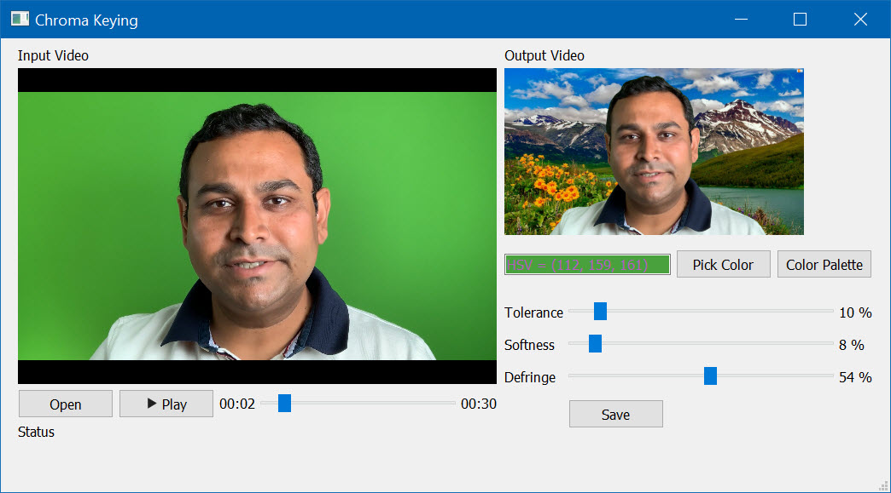

# Chroma Keying Application
change the video background

  



<p float="left">
  
  
</p>

## Python
Install
```
pip install opencv-contrib-python
pip install PyQt5

```

Run
```
python chromakey_run.py
```

## C++
Windows OS

1. Download and Install Qt5
https://www.qt.io/download-open-source

2. Change the path of Qt in file "x64/Release/run.bat" to the installation path in step 1

3. Run file "run.bat"


